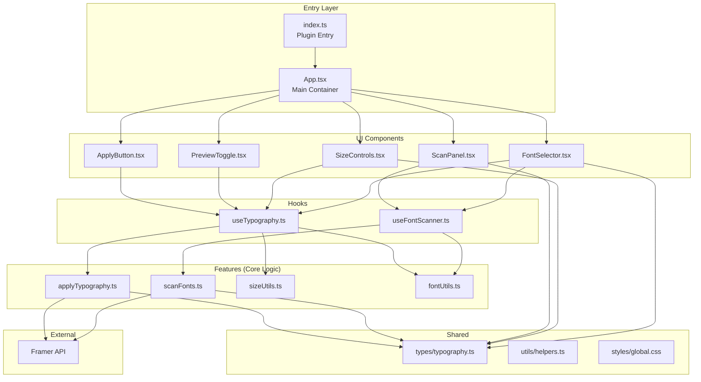
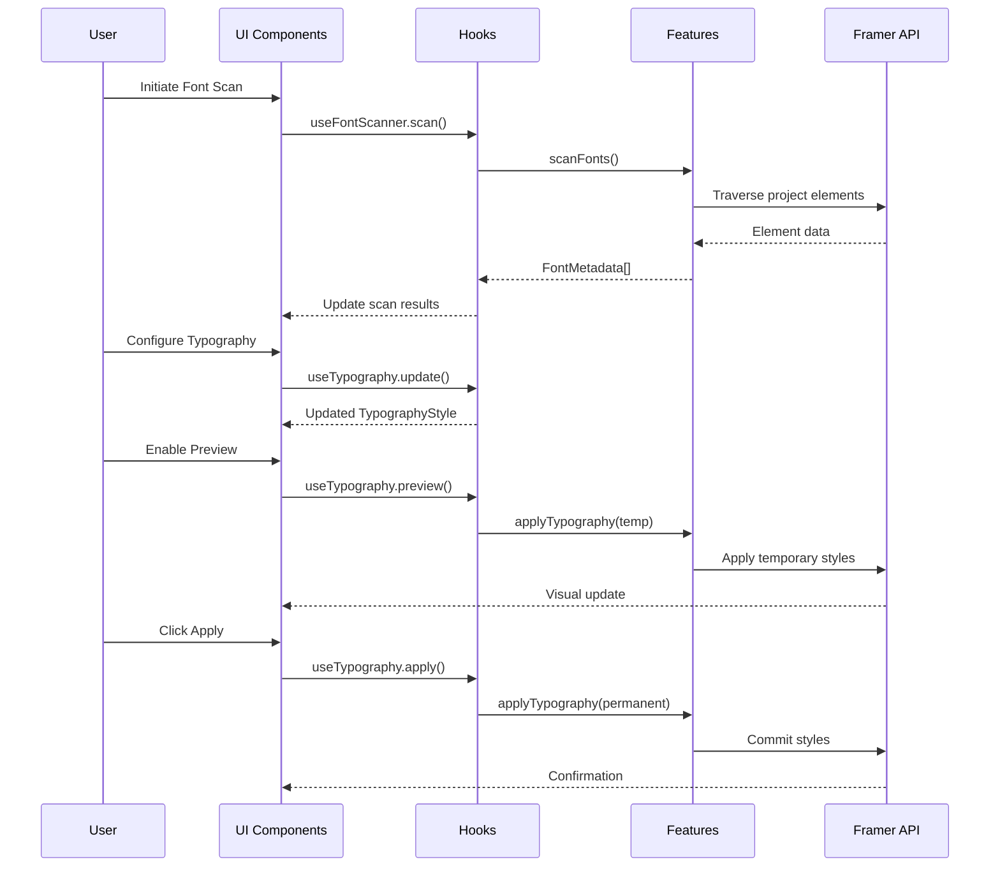

# TypeFlow Framer Plugin - Design Document

## Overview

TypeFlow is a Framer plugin that provides comprehensive typography management capabilities for designers. The plugin enables scanning project fonts, selecting and configuring typography styles, previewing changes in real-time, and applying styles to selected elements. Built with React and TypeScript, it integrates seamlessly with Framer's plugin architecture.

### Key Capabilities

- Font scanning and discovery across Framer projects
- Font selection with weight and style options
- Precise size controls (font size, line height, letter spacing)
- Live preview of typography changes
- Typography style presets for consistency
- Accessible, responsive UI

### Technology Stack

- **Runtime**: Framer Plugin SDK
- **UI Framework**: React with TypeScript
- **Styling**: CSS (global.css)
- **Build**: TypeScript compiler with strict mode

## Architecture

The plugin follows a modular architecture separating UI components, business logic (features), and shared utilities.



### Data Flow



## Components and Interfaces

### Entry Point (index.ts)

Registers the plugin with Framer and initializes the React application.

```typescript
// Responsibilities:
// - Register plugin with Framer SDK
// - Mount App component to plugin container
// - Handle plugin lifecycle events
```

### App.tsx (Main Container)

Root component that orchestrates all UI components and manages global state.

```typescript
interface AppState {
  currentStyle: TypographyStyle;
  scannedFonts: FontMetadata[];
  savedPresets: TypographyPreset[];
  isPreviewEnabled: boolean;
  isScanning: boolean;
  selectedElements: FramerElement[];
  error: AppError | null;
}
```

### FontSelector Component

Displays available fonts and allows selection with weight options.

```typescript
interface FontSelectorProps {
  fonts: FontMetadata[];
  selectedFont: string | null;
  selectedWeight: number;
  onFontSelect: (fontFamily: string) => void;
  onWeightSelect: (weight: number) => void;
  searchQuery: string;
  onSearchChange: (query: string) => void;
}
```

### SizeControls Component

Provides numeric inputs for typography dimensions.

```typescript
interface SizeControlsProps {
  fontSize: number;
  lineHeight: number;
  letterSpacing: number;
  onFontSizeChange: (size: number) => void;
  onLineHeightChange: (height: number) => void;
  onLetterSpacingChange: (spacing: number) => void;
  validationErrors: SizeValidationErrors;
}

interface SizeValidationErrors {
  fontSize?: string;
  lineHeight?: string;
  letterSpacing?: string;
}
```

### ScanPanel Component

Displays font scanning status and results.

```typescript
interface ScanPanelProps {
  isScanning: boolean;
  scannedFonts: FontMetadata[];
  onScanInitiate: () => void;
  error: string | null;
}
```

### PreviewToggle Component

Controls live preview mode.

```typescript
interface PreviewToggleProps {
  isEnabled: boolean;
  isDisabled: boolean;
  disabledReason?: string;
  onToggle: (enabled: boolean) => void;
}
```

### ApplyButton Component

Commits typography changes to selected elements.

```typescript
interface ApplyButtonProps {
  isDisabled: boolean;
  disabledReason?: string;
  isLoading: boolean;
  onClick: () => void;
}
```

### Custom Hooks

#### useFontScanner

Manages font scanning state and operations.

```typescript
interface UseFontScannerReturn {
  scannedFonts: FontMetadata[];
  isScanning: boolean;
  error: string | null;
  scan: () => Promise<void>;
  reset: () => void;
}
```

#### useTypography

Manages typography style state and application.

```typescript
interface UseTypographyReturn {
  currentStyle: TypographyStyle;
  updateStyle: (updates: Partial<TypographyStyle>) => void;
  applyToSelection: () => Promise<ApplyResult>;
  enablePreview: () => void;
  disablePreview: () => void;
  isPreviewActive: boolean;
  presets: TypographyPreset[];
  savePreset: (name: string) => void;
  loadPreset: (presetId: string) => void;
  deletePreset: (presetId: string) => void;
}
```

### Feature Modules

#### scanFonts.ts

```typescript
// Traverses Framer project and extracts font metadata
function scanFonts(project: FramerProject): Promise<FontMetadata[]>;
function extractFontFromElement(element: FramerElement): FontMetadata | null;
function deduplicateFonts(fonts: FontMetadata[]): FontMetadata[];
```

#### applyTypography.ts

```typescript
// Applies typography styles to elements
function applyTypography(
  elements: FramerElement[],
  style: TypographyStyle,
  options: ApplyOptions
): Promise<ApplyResult>;

function revertTypography(
  elements: FramerElement[],
  originalStyles: Map<string, TypographyStyle>
): Promise<void>;

interface ApplyOptions {
  temporary: boolean; // For preview mode
}

interface ApplyResult {
  success: boolean;
  appliedCount: number;
  errors: ApplyError[];
}
```

#### sizeUtils.ts

```typescript
// Size validation and manipulation utilities
function validateFontSize(value: number): ValidationResult;
function validateLineHeight(value: number): ValidationResult;
function validateLetterSpacing(value: number): ValidationResult;
function incrementSize(current: number, step: number): number;
function decrementSize(current: number, step: number, min: number): number;

interface ValidationResult {
  isValid: boolean;
  error?: string;
  sanitizedValue?: number;
}
```

#### fontUtils.ts

```typescript
// Font-related utilities
function getAvailableWeights(fontFamily: string): number[];
function filterFontsByQuery(fonts: FontMetadata[], query: string): FontMetadata[];
function sortFontsByUsage(fonts: FontMetadata[]): FontMetadata[];
```


## Data Models

### Core Types (types/typography.ts)

```typescript
/**
 * Complete typography style configuration
 */
export interface TypographyStyle {
  fontFamily: string;
  fontSize: number;        // in pixels
  fontWeight: number;      // 100-900
  lineHeight: number;      // multiplier (e.g., 1.5)
  letterSpacing: number;   // in pixels
}

/**
 * Metadata about a discovered font
 */
export interface FontMetadata {
  family: string;
  availableWeights: number[];
  styles: FontStyle[];
  usageCount: number;
  elements: string[];      // Element IDs using this font
}

export type FontStyle = 'normal' | 'italic' | 'oblique';

/**
 * Saved typography preset
 */
export interface TypographyPreset {
  id: string;
  name: string;
  style: TypographyStyle;
  createdAt: number;
  updatedAt: number;
}

/**
 * Application error structure
 */
export interface AppError {
  code: ErrorCode;
  message: string;
  details?: unknown;
  recoverable: boolean;
}

export enum ErrorCode {
  INITIALIZATION_FAILED = 'INITIALIZATION_FAILED',
  SCAN_FAILED = 'SCAN_FAILED',
  APPLY_FAILED = 'APPLY_FAILED',
  FRAMER_API_UNAVAILABLE = 'FRAMER_API_UNAVAILABLE',
  VALIDATION_ERROR = 'VALIDATION_ERROR',
  PRESET_SAVE_FAILED = 'PRESET_SAVE_FAILED',
  UNKNOWN_ERROR = 'UNKNOWN_ERROR',
}

/**
 * Framer element representation (simplified)
 */
export interface FramerElement {
  id: string;
  type: string;
  typography?: TypographyStyle;
}

/**
 * Framer project representation
 */
export interface FramerProject {
  id: string;
  elements: FramerElement[];
}
```

### State Management

The plugin uses React hooks for state management with the following state shape:

```typescript
// Global app state managed in App.tsx
interface AppState {
  // Typography configuration
  currentStyle: TypographyStyle;
  originalStyles: Map<string, TypographyStyle>; // For preview revert
  
  // Font scanning
  scannedFonts: FontMetadata[];
  isScanning: boolean;
  scanError: string | null;
  
  // Preview mode
  isPreviewEnabled: boolean;
  
  // Selection
  selectedElements: FramerElement[];
  
  // Presets
  savedPresets: TypographyPreset[];
  
  // Global error state
  error: AppError | null;
}
```

### Persistence

Typography presets are persisted using Framer's plugin storage API:

```typescript
interface StorageSchema {
  presets: TypographyPreset[];
  lastUsedStyle?: TypographyStyle;
}
```


## Correctness Properties

*A property is a characteristic or behavior that should hold true across all valid executions of a system—essentially, a formal statement about what the system should do. Properties serve as the bridge between human-readable specifications and machine-verifiable correctness guarantees.*

### Property 1: Font Scanner Traverses All Elements

*For any* Framer project with N elements, when a font scan is initiated, the scanner should visit exactly N elements (regardless of whether they have typography).

**Validates: Requirements 2.1**

### Property 2: Scanned Fonts Are Unique

*For any* completed font scan result, there should be no duplicate font family entries—each font family appears at most once in the result list.

**Validates: Requirements 2.2**

### Property 3: Typography Extraction Completeness

*For any* element with typography properties, when the font scanner extracts metadata, the resulting FontMetadata object should contain a non-empty font family, at least one available weight, and a usage count of at least 1.

**Validates: Requirements 2.3**

### Property 4: Scanner Resilience to Non-Typography Elements

*For any* element without typography properties, the font scanner should skip it without throwing an error and continue processing remaining elements.

**Validates: Requirements 2.4**

### Property 5: Scanner Error Recovery

*For any* scan operation where some elements fail to process, the scanner should still return FontMetadata for all successfully processed elements, and the error count plus success count should equal total elements attempted.

**Validates: Requirements 2.7**

### Property 6: Selection Updates Typography Style

*For any* font family or weight selection in the FontSelector, the current TypographyStyle should be updated with exactly the selected value in the corresponding field (fontFamily or fontWeight).

**Validates: Requirements 3.2, 3.4**

### Property 7: Font Search Filtering

*For any* search query string and list of fonts, the filtered result should only contain fonts whose family name includes the query string (case-insensitive), and all matching fonts should be included.

**Validates: Requirements 3.6**

### Property 8: Size Validation Accepts Positive Numbers

*For any* numeric input to size controls, the validation function should return valid=true if and only if the value is a positive number (greater than 0).

**Validates: Requirements 4.5**

### Property 9: Invalid Size Reverts to Previous Value

*For any* invalid size input (non-positive or non-numeric), the Size_Controller should revert the displayed value to the previous valid value, and the TypographyStyle should remain unchanged.

**Validates: Requirements 4.6**

### Property 10: Size Change Updates Style

*For any* valid size value change (fontSize, lineHeight, or letterSpacing), the current TypographyStyle should be updated with exactly the new value in the corresponding field.

**Validates: Requirements 4.2**

### Property 11: Preview Mode Round-Trip

*For any* set of selected elements with original typography, enabling preview mode and then disabling it should restore all elements to their exact original typography styles.

**Validates: Requirements 5.1, 5.2**

### Property 12: Preview Updates on Style Change

*For any* style change while preview mode is active, the temporarily applied styles on selected elements should reflect the new TypographyStyle values.

**Validates: Requirements 5.3**

### Property 13: Preview Toggle State Persistence

*For any* sequence of plugin interactions within a session, the Preview_Toggle state (enabled/disabled) should remain consistent unless explicitly toggled by the user or reset by an apply operation.

**Validates: Requirements 5.5**

### Property 14: Apply Typography to All Selected Elements

*For any* apply operation with N selected elements and a TypographyStyle, all N elements should have their typography updated to match the TypographyStyle (fontFamily, fontSize, fontWeight, lineHeight, letterSpacing).

**Validates: Requirements 6.1, 6.4**

### Property 15: Failed Apply Preserves Original Styles

*For any* apply operation that fails, all affected elements should retain their original typography styles—no partial updates should persist.

**Validates: Requirements 6.5**

### Property 16: Apply Disables Preview Mode

*For any* successful apply operation, the preview mode should be disabled and the preview state should be cleared.

**Validates: Requirements 6.6**

### Property 17: Preset Save/Load Round-Trip

*For any* TypographyStyle saved as a preset with a given name, loading that preset should restore the exact same TypographyStyle values (fontFamily, fontSize, fontWeight, lineHeight, letterSpacing).

**Validates: Requirements 7.2, 7.4**

### Property 18: Preset Deletion Removes from List

*For any* deleted preset, querying the saved presets list should not include that preset's ID or name.

**Validates: Requirements 7.6**

### Property 19: Error Handling Preserves State

*For any* operation that throws an error, the application state before the operation should be preserved—no partial state mutations should persist.

**Validates: Requirements 9.4**

### Property 20: Initialization Error Messages

*For any* initialization failure, the displayed error message should contain a description of the failure reason (non-empty error message).

**Validates: Requirements 1.3**

### Property 21: Error Logging Completeness

*For any* caught error, the logged error information should include the error code, message, and stack trace (when available).

**Validates: Requirements 9.2**


## Error Handling

### Error Categories

| Category | Error Code | Recovery Strategy |
|----------|------------|-------------------|
| Initialization | `INITIALIZATION_FAILED` | Display error message, offer retry |
| Font Scanning | `SCAN_FAILED` | Log error, continue with partial results |
| Apply Operation | `APPLY_FAILED` | Revert to original styles, show error |
| Framer API | `FRAMER_API_UNAVAILABLE` | Show connection error, offer retry |
| Validation | `VALIDATION_ERROR` | Revert to previous valid value |
| Preset Storage | `PRESET_SAVE_FAILED` | Show error, preserve in-memory state |

### Error Handling Strategy

```typescript
// Centralized error handler
function handleError(error: unknown, context: string): AppError {
  const appError = normalizeError(error, context);
  
  // Always log for debugging
  console.error(`[TypeFlow] ${context}:`, appError);
  
  // Return structured error for UI
  return appError;
}

// Error boundary for React components
class ErrorBoundary extends React.Component {
  componentDidCatch(error: Error, info: React.ErrorInfo) {
    handleError(error, 'Component render');
  }
}
```

### Recovery Patterns

1. **Transactional Operations**: Apply operations use a transaction pattern—capture original state before mutation, revert on failure.

2. **Graceful Degradation**: Font scanning continues even if individual elements fail, returning partial results.

3. **State Preservation**: All error handlers ensure the user's current work state is preserved.

4. **User Feedback**: All errors display user-friendly messages with actionable guidance.

## Testing Strategy

### Dual Testing Approach

The plugin uses both unit tests and property-based tests for comprehensive coverage:

- **Unit tests**: Verify specific examples, edge cases, and integration points
- **Property tests**: Verify universal properties across randomized inputs

### Property-Based Testing Configuration

- **Library**: fast-check (TypeScript property-based testing)
- **Minimum iterations**: 100 per property test
- **Tag format**: `Feature: typeflow-plugin, Property {number}: {property_text}`

### Test Organization

```
tests/
├── unit/
│   ├── components/
│   │   ├── FontSelector.test.tsx
│   │   ├── SizeControls.test.tsx
│   │   ├── ScanPanel.test.tsx
│   │   ├── PreviewToggle.test.tsx
│   │   └── ApplyButton.test.tsx
│   ├── features/
│   │   ├── scanFonts.test.ts
│   │   ├── applyTypography.test.ts
│   │   ├── sizeUtils.test.ts
│   │   └── fontUtils.test.ts
│   └── hooks/
│       ├── useFontScanner.test.ts
│       └── useTypography.test.ts
├── property/
│   ├── scanning.property.test.ts
│   ├── typography.property.test.ts
│   ├── validation.property.test.ts
│   └── presets.property.test.ts
└── integration/
    └── plugin.integration.test.ts
```

### Unit Test Focus Areas

- Component rendering and user interactions
- Edge cases (empty inputs, boundary values)
- Error conditions and recovery
- Integration between hooks and features

### Property Test Implementation

Each correctness property maps to a property-based test:

```typescript
// Example: Property 2 - Scanned Fonts Are Unique
// Feature: typeflow-plugin, Property 2: Scanned Fonts Are Unique
test.prop([fc.array(fc.record({
  family: fc.string({ minLength: 1 }),
  weight: fc.integer({ min: 100, max: 900 }),
  hasTypography: fc.boolean()
}))])('scanned fonts have unique families', (elements) => {
  const result = deduplicateFonts(extractFonts(elements));
  const families = result.map(f => f.family);
  const uniqueFamilies = new Set(families);
  expect(families.length).toBe(uniqueFamilies.size);
});
```

### Test Coverage Requirements

| Area | Unit Tests | Property Tests |
|------|------------|----------------|
| Font Scanning | Examples, errors | Properties 1-5 |
| Font Selection | UI interactions | Properties 6-7 |
| Size Controls | Validation, UI | Properties 8-10 |
| Preview Mode | Toggle behavior | Properties 11-13 |
| Apply Typography | Success, failure | Properties 14-16 |
| Presets | CRUD operations | Properties 17-18 |
| Error Handling | Specific errors | Properties 19-21 |

### Mocking Strategy

- **Framer API**: Mock using jest mocks for unit tests
- **Storage**: In-memory mock for preset persistence
- **Elements**: Generate random elements using fast-check arbitraries
